<div align="center">

# pubmed-rag

**A production-grade RAG pipeline for clinical literature.**

Fetch PubMed abstracts, embed them into a vector store, and answer natural-language
questions grounded in retrieved papers with inline citations.

[](https://github.com/omkaradhali/pubmed_rag/actions/workflows/ci.yml)
[](https://github.com/omkaradhali/pubmed_rag/actions/workflows/ci.yml)
[](LICENSE)
[](https://python.org)
[](https://github.com/astral-sh/ruff)

</div>

> **Built for** clinical researchers, bioinformaticians, and developers learning biomedical RAG.

> [!WARNING]
> **For research and educational use only.** pubmed_rag is not a medical device and is not intended for diagnosis, treatment, or clinical decision-making. See [Intended Use, Safety & Limitations](#intended-use-safety--limitations).

---

## Contents

- [Features](#features)
- [Architecture](#architecture)
- [Intended Use, Safety & Limitations](#intended-use-safety--limitations)
- [Quick Start](#quick-start)
- [Manual Pipeline (CLI)](#manual-pipeline-cli)
- [HL7 CDS Hooks Integration](#hl7-cds-hooks-integration)
- [Configuration](#configuration)
- [Evaluation](#evaluation)
- [Project Structure](#project-structure)
- [Docker](#docker)
- [Design Decisions](#design-decisions)
- [Contributing](#contributing)
- [Citation](#citation)
- [License](#license)

---

## Features

- **Full ingestion pipeline:** PubMed E-utilities → parent-child chunking → sentence-transformer embeddings → ChromaDB
- **Two-stage retrieval:** bi-encoder dense retrieval shortlists candidates; `ncbi/MedCPT-Cross-Encoder` reranks for clinical relevance
- **Dynamic hybrid search:** entity-gated BM25+RRF fusion activates only when the query contains named entities (drug names, gene symbols, trial IDs); dense-only otherwise
- **Input and output guardrails:** topic relevance check and injection detection gate queries before retrieval; citation presence and lexical faithfulness checks flag answers after generation
- **Citation-enforced generation:** the LLM is instructed to cite every claim inline; hallucinated sources are structurally prevented
- **HL7 CDS Hooks integration:** `GET /cds-services` discovery and `POST /cds-services/pubmed-rag` patient-view hook; plug into any CDS Hooks-compatible EHR
- **Gradio demo UI:** browser-based interface at `demo/gradio_app.py`; no API tooling required
- **Pluggable providers:** swap the LLM (Ollama, Anthropic, OpenAI) and embedding model via a single env var
- **FastAPI backend:** structured JSON responses, request ID tracing, Swagger docs at `/docs`
- **Dual evaluation suite:** RAGAS (LLM-as-judge) and deterministic recall@k/MRR/nDCG against a 97-question labeled benchmark
- **Docker and CI:** ready-to-run Docker image and GitHub Actions workflow included

---

## Architecture

### Ingestion (offline, run once or on a schedule)

<div align="center">



<sub>Source: <a href="docs/img/architecture-ingestion.mmd">architecture-ingestion.mmd</a></sub>

</div>

### Query path (online, ~1-3 sec)

<div align="center">



<sub>Source: <a href="docs/img/architecture-query-path.mmd">architecture-query-path.mmd</a></sub>

</div>

Retrieval metrics at N=97 labeled questions: **recall@20 = 0.97 · MRR = 0.95 · nDCG@20 = 0.90**.

The pipeline runs in two modes:

- **`incremental`** (default): queries the pre-seeded vector store. Fast, ~1-3 sec, mostly LLM latency.
- **`full`**: wipes and rebuilds the corpus from scratch before querying. Use when the corpus is stale.

---

## Intended Use, Safety & Limitations

> [!WARNING]
> **Research and educational use only.** pubmed_rag is not a medical device, is not FDA-cleared, and is not intended for diagnosis, treatment, or any clinical decision-making. Answers are generated from abstract text and may be incomplete or wrong. Always defer to a qualified clinician and to primary sources.

- **Not a medical device.** No output should be used to guide patient care. There is no regulatory clearance and no warranty of clinical accuracy.
- **The corpus is a bounded snapshot.** The system answers only from PubMed *abstracts* (not full text), for whatever `INGEST_QUERY` (or `--specialty`, for multi-specialty deployments — see [docs/decisions/multi-specialty-corpus.md](docs/decisions/multi-specialty-corpus.md)) you ingested. It does not auto-refresh, so answers reflect the literature as of your last ingestion run and anything published after that date is absent.
- **PHI stays local.** Query de-identification (Presidio) is best-effort defense in depth, **not** a HIPAA Safe Harbor guarantee. For any workflow that may involve real patient data, run the fully local stack (`LLM_PROVIDER=ollama` plus a local embedder, `miniml` or `medcpt`) so no text leaves the server. Do not send PHI to cloud providers.
- **HL7 CDS Hooks integration is experimental.** The `/cds-services` endpoints are a functional reference implementation of the spec, unvalidated in any live EHR and not for clinical use.

Full detail, including retrieval, guardrail, and evaluation caveats, is in [docs/known-limitations.md](docs/known-limitations.md).

---

## Quick Start

### Requirements

- Python 3.12+
- [uv](https://github.com/astral-sh/uv), a fast Python package manager
- [Ollama](https://ollama.com) running locally (default LLM provider), **or** an `ANTHROPIC_API_KEY`

### Install

```bash
git clone https://github.com/omkaradhali/pubmed_rag
cd pubmed_rag
uv venv .venv && source .venv/bin/activate
uv pip install -e ".[dev]"
cp .env.example .env
# Edit .env: set NCBI_API_KEY (optional) and your chosen LLM provider key
```

### Seed the corpus and run a query

```bash
# Fetch 500 oncology abstracts, build the vector store, and answer a question
python -m pubmed_rag.pipeline "What is the mechanism of PD-1 checkpoint inhibition?" --mode full
```

### Run the API

```bash
uvicorn api.main:app --reload --port 8001
# Open http://localhost:8001/docs for the interactive Swagger UI
```

### Query via API

```bash
curl -s -X POST http://localhost:8001/ask \
  -H "Content-Type: application/json" \
  -d '{"query": "What biomarkers predict response to immunotherapy?"}' | jq .
```

### Gradio demo UI

```bash
pip install gradio httpx
API_BASE_URL=http://localhost:8001 python demo/gradio_app.py
# Open http://localhost:7860
```

---

## Manual Pipeline (CLI)

Run each stage individually instead of the one-shot `pipeline` command:

```bash
# 1. Fetch abstracts
python -m pubmed_rag.ingest --query "oncology[Title/Abstract]" --max-results 500 \
  --output data/abstracts.jsonl

# 2. Chunk
python -m pubmed_rag.chunk --input data/abstracts.jsonl --output data/chunks.jsonl

# 3. Embed
python -m pubmed_rag.embed --input data/chunks.jsonl --output data/embeddings.jsonl

# 4. Seed vector store
python -m pubmed_rag.vectorstore --input data/embeddings.jsonl

# 5. Query
python -m pubmed_rag.pipeline "What are the treatments for HER2-positive breast cancer?" --verbose
```

---

## HL7 CDS Hooks Integration

> [!NOTE]
> **Experimental.** This is a functional reference implementation of the CDS Hooks spec. It has not been validated in a live EHR and is not for clinical use.

pubmed_rag implements the [HL7 CDS Hooks 1.0](https://cds-hooks.hl7.org/1.0/) specification. Any CDS Hooks-compatible EHR can subscribe to the pubmed-rag service and receive cited oncology evidence cards during the patient-view workflow.

### Discovery

```bash
curl http://localhost:8001/cds-services
```

```json
{
  "services": [{
    "hook": "patient-view",
    "title": "Oncology Evidence Search (pubmed_rag, experimental)",
    "description": "EXPERIMENTAL and unvalidated, not for clinical use. Search indexed PubMed oncology abstracts and receive a cited, LLM-synthesised evidence summary for the current clinical question. Provide the clinical question in context.query.",
    "id": "pubmed-rag",
    "prefetch": {}
  }]
}
```

### Query the service

```bash
curl -s -X POST http://localhost:8001/cds-services/pubmed-rag \
  -H "Content-Type: application/json" \
  -d '{
    "hookInstance": "example-001",
    "hook": "patient-view",
    "context": {
      "userId": "Practitioner/dr-smith",
      "patientId": "patient-42",
      "query": "What is the first-line treatment for HER2-positive metastatic breast cancer?"
    }
  }' | jq .
```

The service returns a CDS card with the synthesized answer, inline citations, and direct PubMed links:

```json
{
  "cards": [{
    "uuid": "...",
    "summary": "Evidence: The first-line treatment is dual HER2 blockade with trastuzumab...",
    "detail": "Full answer with [1][2][3] inline citations...\n\n**Sources**\n1. ...",
    "indicator": "info",
    "source": {
      "label": "pubmed_rag Oncology Evidence Service",
      "url": "https://pubmed.ncbi.nlm.nih.gov"
    },
    "links": [
      { "label": "[1] PMID 42041395 Post-Chemotherapy Antibody-Based...", "url": "https://pubmed.ncbi.nlm.nih.gov/42041395/", "type": "absolute" }
    ]
  }]
}
```

**EHR integration:** register `http://your-host:8001` as a CDS Hooks service base URL in your EHR's CDS Hooks configuration. The `context.query` field accepts the clinical question directly; in a full integration this can be synthesized from the patient's FHIR problem list or encounter diagnosis.

---

## Configuration

Copy `.env.example` to `.env`. All variables have sensible defaults for local development.

| Variable | Default | Description |
|---|---|---|
| `NCBI_API_KEY` | `(none)` | NCBI API key. Optional, but raises the rate limit from 3 to 10 req/s |
| `LLM_PROVIDER` | `ollama` | LLM backend: `ollama`, `anthropic`, or `openai` |
| `LLM_MODEL` | `llama3.1:8b` | Model name for the selected provider |
| `ANTHROPIC_API_KEY` | `(none)` | Required when `LLM_PROVIDER=anthropic` |
| `OPENAI_API_KEY` | `(none)` | Required when `LLM_PROVIDER=openai` |
| `OLLAMA_BASE_URL` | `http://localhost:11434/v1` | Ollama API endpoint |
| `CHROMA_PERSIST_DIR` | `./data/chroma_db` | ChromaDB persistence directory |
| `EMBEDDING_PROVIDER` | `miniml` | Embedding model: `miniml` (all-MiniLM, local), `bge` (stronger, local), or `medcpt` (biomedical, local) |
| `INGEST_QUERY` | `oncology[Title/Abstract]` | PubMed search string for corpus ingestion (fallback when no `--specialty` flag is passed) |
| `INGEST_MAX_RESULTS` | `500` | Maximum abstracts per ingestion run |
| `LOG_LEVEL` | `INFO` | API log level |

See `.env.example` for the full list including observability variables (Logfire, Langfuse).

---

## Evaluation

Evaluated on a 5,000-abstract oncology corpus across two metric families.

### RAGAS (LLM-as-judge, 20 clinical oncology questions)

| Metric | v0.1 (500 abstracts) | v0.2 (5,000 abstracts) |
|---|---|---|
| Faithfulness | 0.84 | **0.91** |
| Answer relevancy | 0.33 | **0.81** |
| Context precision | 0.15 | 0.53 |

Faithfulness of 0.91 confirms citation enforcement is working: 91% of answer statements are grounded in retrieved context.

### Deterministic retrieval metrics (97 labeled questions, zero variance)

Evaluated against a 97-question oncology benchmark with gold PubMed labels. These metrics use no LLM judge, so results are identical across runs.

| Metric | Score |
|---|---|
| Recall@5 | 0.67 |
| Recall@10 | 0.82 |
| **Recall@20** | **0.97** |
| **MRR** | **0.95** |
| nDCG@20 | 0.90 |

Recall@20 of 0.97 means the correct abstract appears in the top 20 results for 97% of questions. MRR of 0.95 means the first relevant result is ranked first or second on average.

### Run the evaluation

```bash
# RAGAS (requires ANTHROPIC_API_KEY)
uv pip install -e ".[eval]"
python scripts/eval_v0_2.py --output eval/results.csv

# Deterministic retrieval metrics only (no LLM cost)
python scripts/eval_v0_2.py \
  --questions eval/questions.sample.jsonl \
  --output eval/results_retrieval.csv \
  --no-ragas
```

---

## Project Structure

```
pubmed_rag/
├── src/pubmed_rag/         # core pipeline library
│   ├── ingest.py           # PubMed E-utilities fetcher
│   ├── chunk.py            # parent-child RecursiveCharacterTextSplitter
│   ├── embed.py            # sentence-transformer embedder (pluggable provider)
│   ├── vectorstore.py      # ChromaDB persistence and retrieval
│   ├── parents.py          # parent-doc sidecar JSONL store + lazy-load cache
│   ├── retrieve.py         # dense retrieval + optional BM25+RRF hybrid
│   ├── rerank.py           # ncbi/MedCPT-Cross-Encoder reranker
│   ├── generate.py         # citation-enforced LLM caller (Ollama / Anthropic / OpenAI)
│   ├── guardrails.py       # input/output safety checks (topic, injection, citations, faithfulness)
│   ├── types.py            # shared TypedDicts and dataclasses
│   └── pipeline.py         # end-to-end orchestrator + PipelineResult dataclass
├── api/                    # FastAPI application
│   ├── main.py             # app factory, CORS middleware, request-ID injection
│   ├── config.py           # Pydantic BaseSettings
│   ├── schemas.py          # request / response models
│   ├── logging_config.py   # structured JSON logging + request ID context var
│   └── routers/
│       ├── health.py       # GET /health
│       ├── ask.py          # POST /ask
│       └── cds_hooks.py    # GET /cds-services, POST /cds-services/pubmed-rag
├── demo/
│   └── gradio_app.py       # Gradio web UI (calls /ask, runs on port 7860)
├── eval/
│   ├── evaluate.py         # RAGAS evaluation (20 questions, 3 metrics)
│   ├── retrieval_metrics.py # recall@k, MRR, nDCG@k (deterministic, zero LLM cost)
│   └── questions.sample.jsonl  # 15-question public eval sample
├── scripts/
│   └── eval_v0_2.py        # unified eval driver (RAGAS + deterministic, --questions flag)
├── tests/                  # pytest unit tests (220 tests, zero external dependencies)
├── docs/
│   ├── decisions/          # design decision docs
│   └── known-limitations.md
├── Dockerfile
├── docker-compose.yml
└── .env.example
```

---

## Docker

```bash
# Build (use --network=host if your firewall blocks Docker bridge outbound traffic)
docker build -t pubmed-rag .

# Run with docker compose
docker compose up
```

The Docker image pre-bakes the `all-MiniLM-L6-v2` model weights to avoid download latency at container start.

---

## Design Decisions

Notable architecture decisions are documented in `docs/decisions/`:

| Decision | Summary |
|---|---|
| [Multi-specialty corpus](docs/decisions/multi-specialty-corpus.md) | Serve several specialties (oncology, neuroscience, ...) from one deployment via a metadata filter, not separate corpora |
| [Guardrails](docs/decisions/guardrails.md) | Deterministic input/output guardrails: pattern-based, no LLM cost |
| [Hybrid BM25+dense+RRF](docs/decisions/hybrid-bm25-rrf.md) | Dynamic hybrid search: entity-gated, dense-only default |

---

## Contributing

See [CONTRIBUTING.md](CONTRIBUTING.md).

---

## Citation

If you use this software in your research, please cite it:

```bibtex
@software{adhali2026pubmedrag,
  author  = {Adhali, Omkar},
  title   = {pubmed-rag: A RAG Pipeline for Clinical Literature},
  url     = {https://github.com/omkaradhali/pubmed_rag},
  year    = {2026},
  license = {MIT}
}
```

---

## AI usage disclosure

Generative AI tools (Anthropic's Claude) were used to assist with software
development and documentation for this project. All AI-assisted output was
reviewed, tested, and validated by the author, who takes full responsibility
for the content of the software and its documentation.

---

## License

MIT © [Omkar Adhali](https://github.com/omkaradhali)
